# NeuraCare 🩺✨  
*AI-Powered Chronic Disease Tracking & Comorbidity Management Platform*  

  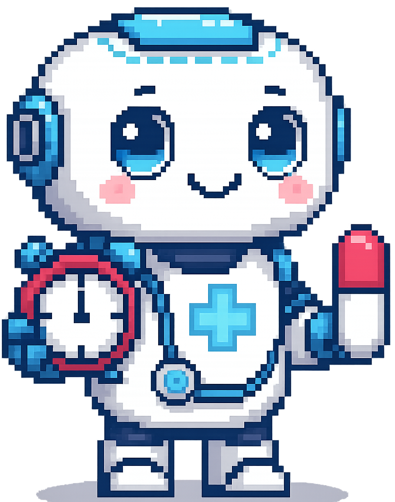

---

## 📌 Overview  
NeuraCare is an **AI-driven integrated platform** designed for proactive **chronic disease tracking and comorbidity management**, targeting **any type of users**.  

It combines:  
- 🩺 **Vitals & Symptoms Tracking**  
- 💊 **Medication Adherence**  
- 🥗 **Nutrition & Lifestyle Guidance**  
- 🤖 **AI-Powered Predictive Analytics**
- 🤖 **Personalised chat bot for any assistance** 

Built as a **cross-platform Flutter app** with an **Express backend deployed on Render**. It ensures **scalability**, **real-time synchronization**, and **secure health data management**.  

---

## 🚀 Key Features  
✅ **AI-Powered Personalized Insights** – Risk alerts, lifestyle & diet guidance  
✅ **Comprehensive Health Tracking** – Vitals, symptoms, lifestyle, nutrition  
✅ **Smart Medication Reminders** – Automated reminders & safety checks  
✅ **Personalized Meal Planning** – AI-driven diet planning + grocery integration  
✅ **Gamified Mascot Dashboard** – Motivation for healthy habits   
✅ **Cloud-Enabled Architecture** – Render with future IoT & wearable integrations  

  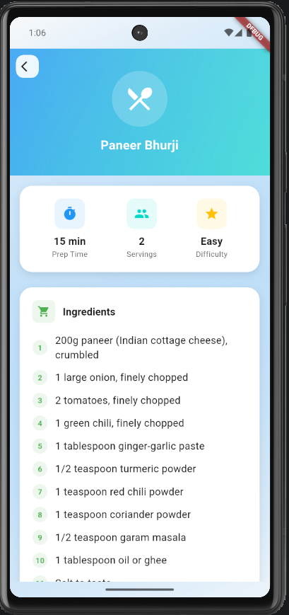
  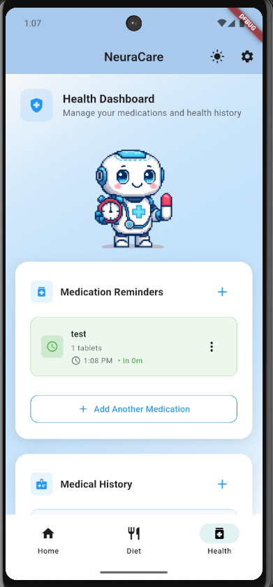
  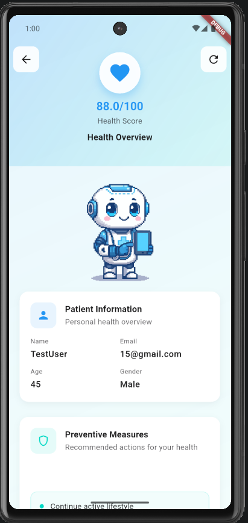

---

## 💡 Innovation  
- 🔗 **Integrated Multi-Disease Management** (unified platform vs fragmented tools)  
- 🤖 **AI-Powered Personalization** (Gemini-driven risk predictions & reminders)  
- 📱 **Cross-Platform Flutter Development** (Android & iOS with one codebase)  
- 🎮 **Gamified Engagement** (insurance-linked rewards & goals)  
- 📊 **Predictive Preventive Care** (early detection of comorbidity risks)  

---

## 🔑 Unique Selling Points (USP)  
✨ **Holistic Care** → Multiple diseases, one platform  
✨ **AI-Driven Personalization** → Risk alerts, diet, lifestyle plans  
✨ **Preventive Focus** → Early detection lowers costs & complications  
✨ **All-in-one Platform** → Integrated everything in one single app  
---

## 🌍 Impact & Usefulness  
- 📂 **Centralized Health Data** – One-stop tracking  
- 🧑‍⚕️ **Improved Self-Management** – Actionable AI insights  
- ⏰ **Medication Adherence** – Smart reminders & safety alerts   
- 💰 **Reduced Healthcare Costs** – Prevention > hospitalization  
- 🌐 **Population-Scale Impact** – Chronic disease burden reduction  

---

## 📈 Feasibility  
- 📱 **Flutter Cross-Platform** → Fast Android/iOS development  
- ☁️ **Express Backend** → Scalable, secure, real-time sync  
- 💸 **Lean MVP Budget** → ~$5k–$10k/month feasible dev costs or less depending upon the charges of the Render services only. 
- 🌏 **User-Centric Design** → Accessible UI    
- 🔮 **Future-Ready** → Wearables, IoT, insurer integrations  

---

## 🛠️ Tech Stack  

- 📱 **Frontend** → Flutter (packages for UI, reminders)  
- ⚙️ **Backend** → Express server with **Gemini 2.5 Flash**, fetching user data from **MongoDB**  
- ☁️ **Backend Deployment** → Render 
- 🗄️ **Database Backend** → MongoDB (user profiles, vitals, health history, etc)
- 📱 **Database Frontend** → Flutter Hive
- 🔔**App Notifications** → Flutter Local notifications
- ⚙️ **State Management** → Flutter Riverpod
- 🧠 **AI & Analytics** → Predictive modeling using Generative AI
---

## ⁉️ How to install the deployed app
- Go to the Releases page of the Github repo
- Download the apk on your phone through the link
- Install the apk on the phone and simply open the installed app.
---

## 🔮 Future Directions  
- ⌚ Integration with **wearables & IoT devices**  
- 🧬 **Digital Twin Modeling** for personalized health simulations  
- 🔐 **Secure Data Ownership & Sharing** (user control & monetization)  

---

## 📷 Preview (Screenshots) 

  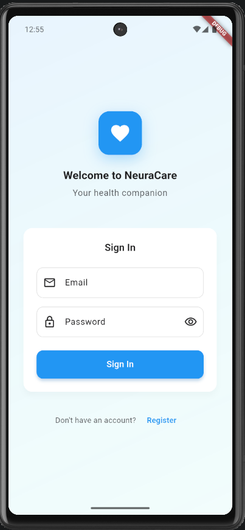
  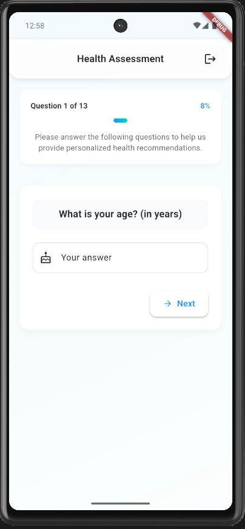
  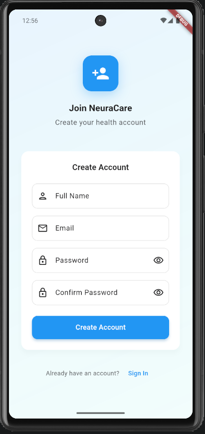

  
  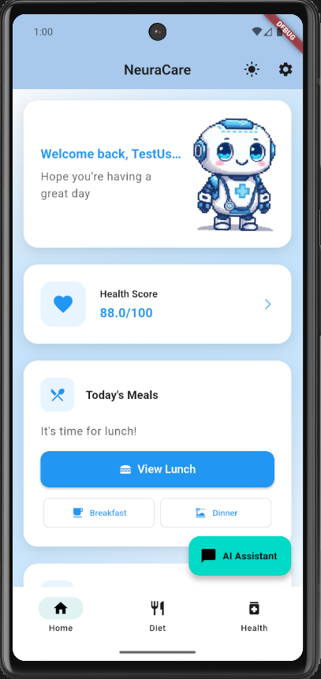
  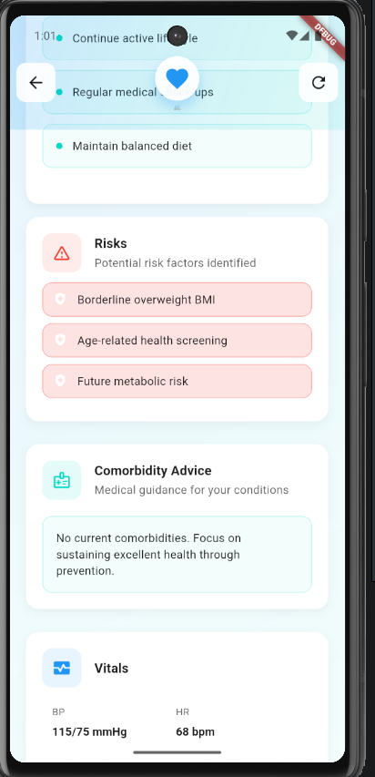

  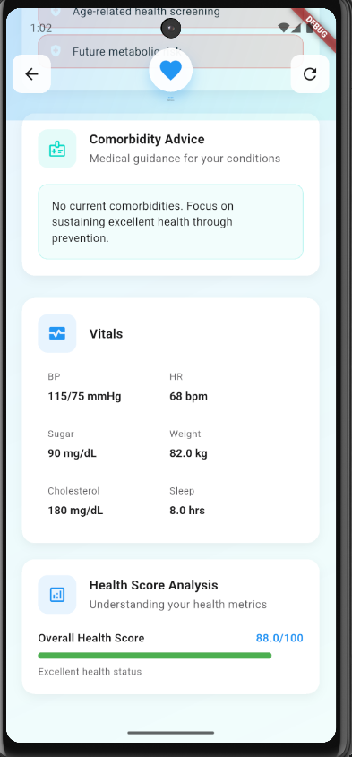
  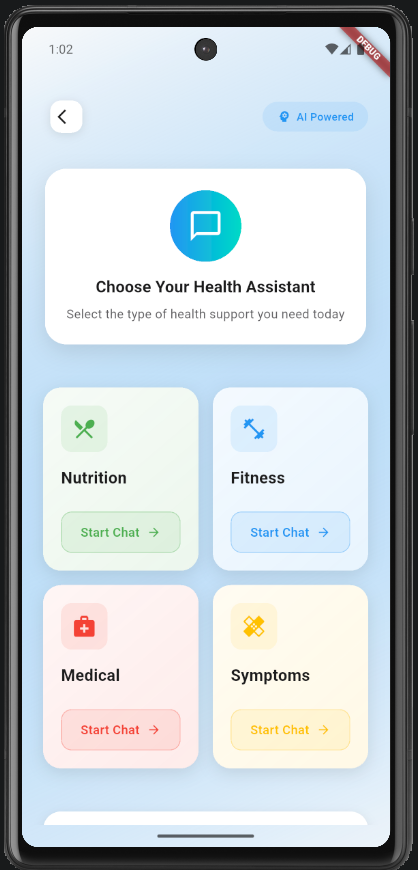
  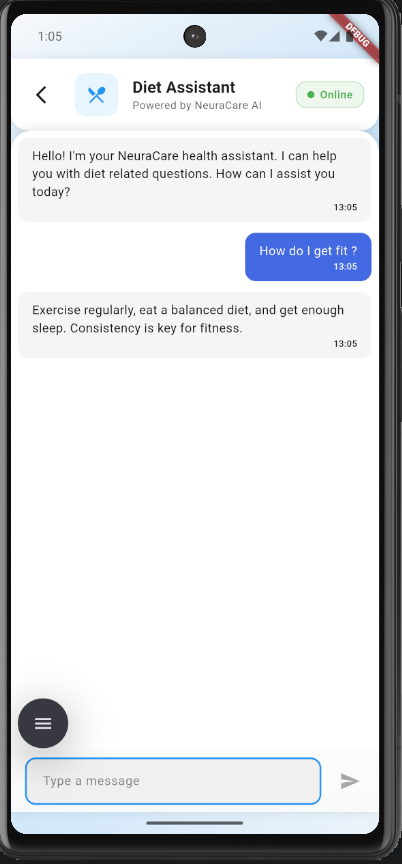

---

## 📄 License  
Licensed under the **MIT License** – see [LICENSE](./LICENSE).  

---

## 🤝 Contributors  
👩‍💻 **Team CureTech** – Building holistic, intelligent, and preventive health solutions.  
